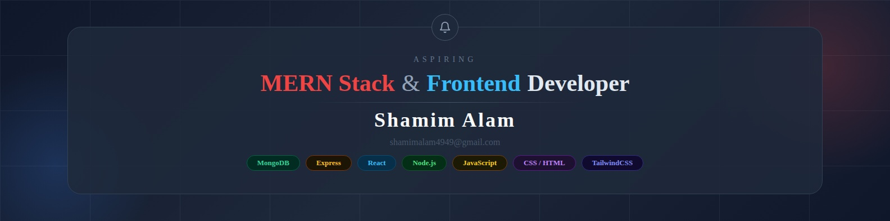

  

  

<!-- Proudly created with Github Readme Maker ( https://github-readme-maker-pi.vercel.app/ ) -->
<h3 align="center">Frontend Developer | Learning MERN Stack | React • Node.js • Express.js • MongoDB</h3>

---

## Profile Summary

Passionate Front-End Developer skilled in React, Tailwind CSS, HTML, CSS, and JavaScript, with experience building clean, responsive, and user-friendly web applications. Currently learning the MERN stack, including Node.js, Express.js, and MongoDB, to develop full-stack applications and strengthen backend development skills.

Background in Computer Science with strong programming fundamentals and problem-solving abilities, focused on creating modern and efficient web solutions.

---

## Core Competencies

* Front-End Development with React & Tailwind CSS
* Responsive & Interactive UI Design
* HTML, CSS & JavaScript Development
* React Component-Based Architecture
* REST API Integration
* MERN Stack Learning & Development
* Problem Solving & Debugging
* Clean & User-Friendly UI Development
* Version Control with Git & GitHub
  
---

## Technical Skills

### Data Analysis
- SQL (Joins, CTEs, Subqueries, Aggregations)
- Microsoft Excel (Pivot Tables, Power Query, Advanced Functions)
- Power BI (DAX, Interactive Dashboards, Reports)

### Front-End Development
- HTML5, CSS3, Tailwind CSS
- JavaScript (ES6+) & React
- Responsive & User-Friendly UI Design
- REST API Integration
- Component-Based Development

### MERN Stack Learning
- Node.js
- Express.js
- MongoDB
- Full-Stack Application Development Basics

### Programming Foundations
- C
- C++
- JavaScript (ES6+)

---

## 🌐 Socials:
   

# 💻 Tech Stack:
                 

## 📈 GitHub Stats

  

  

### ✍️ Random Dev Quote

### 📊 Profile Views

## 🌱 I’m currently learning:
- React
- Next.JS
- Express.JS
- MongoDB
- Problem Solving
