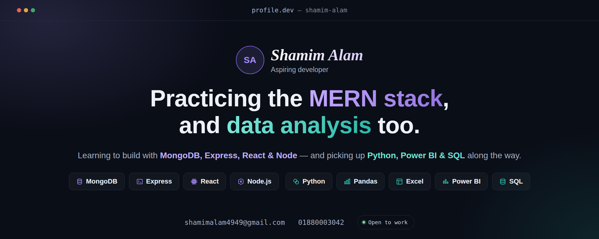

<h3>Frontend Developer &nbsp;·&nbsp; React &amp; Tailwind Specialist &nbsp;·&nbsp; MERN Stack Learner &nbsp;·&nbsp; Data Analyst in Progress</h3>

  
  

  
  
  

 

## 🧭 About Me

I'm a **Frontend Developer** who loves building fast, responsive, and user-friendly web applications with **React.js** and **Tailwind CSS**. My goal isn't just to make things work — it's to write **clean, reusable, and scalable** code.

I'm currently leveling up in the **MERN Stack** so I can design, build, and deploy complete full-stack products on my own. Alongside development, I've also been learning **Data Analysis** — working with **Excel, Power BI, and PostgreSQL** to clean messy datasets, build dashboards, and turn raw numbers into insights people can actually use.

<table width="100%">
<tr>
<td width="50%" valign="top">

### ⚡ Quick Facts
- 🎯 **Focus:** Frontend + MERN Stack + Data Analysis
- 🌱 **Currently mastering:** Node.js, Express.js, MongoDB, JWT
- 📊 **Also learning:** Excel, Power BI, PostgreSQL, Data Cleaning & Dashboards
- 💬 **Best at:** React Hooks, Component Architecture, Tailwind CSS
- 🎓 **Learning style:** Project-based, real-world clones & datasets
- 🤝 **Open to:** Internship / Junior Frontend / Data Analyst roles

</td>
<td width="50%" valign="top">

### 📈 My Journey
| Skill | Progress |
|---|---|
| HTML, CSS, JS (ES6+) | 🟩🟩🟩🟩🟩 Solid |
| React.js + Tailwind | 🟩🟩🟩🟩🟨 Comfortable |
| Node.js + Express.js | 🟩🟩🟨⬜⬜ In progress |
| MongoDB + JWT Auth | 🟩🟩🟨⬜⬜ In progress |
| Excel + Data Cleaning | 🟩🟩🟩🟨⬜ Comfortable |
| Power BI Dashboards | 🟩🟩🟨⬜⬜ In progress |
| PostgreSQL (SQL) | 🟩🟩🟨⬜⬜ In progress |
| Full MERN Deployment | 🟩⬜⬜⬜⬜ Next milestone |

</td>
</tr>
</table>

 

## 🛠 Tech Stack

  

 

<table width="100%">
<tr><th align="left" width="22%">Category</th><th align="left">Technologies</th></tr>
<tr><td>🎨 <b>Frontend</b></td><td>React.js (Hooks, Component Architecture) · JavaScript (ES6+) · Tailwind CSS · Responsive Web Design</td></tr>
<tr><td>⚙️ <b>Backend</b> <i>(Learning)</i></td><td>Node.js · Express.js · MongoDB · JWT Authentication</td></tr>
<tr><td>📊 <b>Data Analysis</b> <i>(Learning)</i></td><td>Excel (formulas, pivot tables, data cleaning) · Power BI (dashboards, DAX, reports) · PostgreSQL (queries, joins, data modeling)</td></tr>
<tr><td>🧰 <b>Tools &amp; Workflow</b></td><td>Git · GitHub · VS Code · REST API Integration</td></tr>
<tr><td>💡 <b>Core Strengths</b></td><td>Problem Solving · Debugging · Clean Code Practices · Data Cleaning</td></tr>
</table>

 

## 🚀 What I'm Building

<table width="100%">
<tr>

<td align="center" width="20%">
🌐 
<b>Frontend Projects</b> 
Building responsive and interactive web applications using HTML, CSS, JavaScript, React, and Tailwind CSS.
</td>

<td align="center" width="20%">
💻 
<b>Full-Stack MERN Apps</b> 
Developing scalable web applications with MongoDB, Express.js, React, Node.js, authentication, and CRUD operations.
</td>

<td align="center" width="20%">
🔌 
<b>RESTful APIs</b> 
Designing secure backend APIs with Express.js, JWT authentication, CRUD functionality, and MongoDB integration.
</td>

<td align="center" width="20%">
📊 
<b>Data Cleaning & Dashboards</b> 
Cleaning messy datasets and building interactive dashboards and reports with Excel, Power BI, and PostgreSQL.
</td>

<td align="center" width="20%">
🤖 
<b>AI-Assisted Development</b> 
Leveraging AI tools to accelerate development, debugging, and learning while writing clean, maintainable code.
</td>

</tr>
</table>

## 📌 Featured Projects

<table width="100%">
  <tr>
    <td width="50%" valign="top">
      <h4>📚 Book Management System</h4>
    A Full-Stack Book Management System built with the MERN stack. This application allows users to manage books, borrow/return books, write reviews, track reading progress, and analyze statistics with a beautiful, responsive UI..  
        
        
      🔗 <a href="https://github.com/shamim-01/book-management">Repository</a> &nbsp;|&nbsp; 🌐 <a href="https://book-management-gold-seven.vercel.app">Live Demo</a>
    </td>
    <td width="50%" valign="top">
      <h4>🌐 University Management</h4>
     A comprehensive University Management System built with the MERN Stack. Features role-based access control for Admin, Teachers, and Students with a modern, responsive dashboard UI.  
       
         
      🔗 <a href="https://github.com/shamim-01/university_management">Repository</a> &nbsp;|&nbsp; 🌐 <a href="https://university-management-ruddy.vercel.app/dashboard">Live Demo</a>
    </td>
  </tr>
  <tr>
    <td width="50%" valign="top">
      <h4>🌦 The Coding Journey Website</h4>
     The Coding Journey is a platform dedicated to empowering aspiring developers.
From beginner tutorials to advanced programming concepts, we provide a complete learning experience to help you master coding, build real-world projects, and grow your tech career.  
          
      🔗 <a href="https://github.com/shamim-01/React-project-coding_journey">Repository</a> &nbsp;|&nbsp; 🌐 <a href="https://react-project-coding-journey.vercel.app/">Live Demo</a>
    </td>
    <td width="50%" valign="top">
      <h4>📊 Sales Data Cleaning & Dashboard</h4>
      Cleaned and structured a raw sales dataset in Excel, then loaded it into PostgreSQL for querying and built an interactive Power BI dashboard to track revenue, top products, and monthly trends.  
          
      🔗 <a href="#">Repository</a> &nbsp;|&nbsp; 🌐 <a href="#">Live Demo</a>
    </td>
  </tr>
</table>

## 📊 GitHub Stats

  
  

  

## 🤝 Let's Connect

I'm always open to discussing new projects, collaborations, or learning opportunities — in web development or data analysis.
Feel free to reach out on any platform below — I try to reply to everyone.

  

<i>⭐ Thanks for visiting my profile — feel free to explore my repositories and connect!</i>

